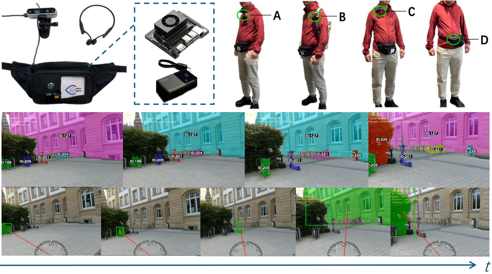

# OpenVision4Blind
The repository for the OpenVision4Blind project. 

In this work, we propose OpenVision4Blind (short for **Open**-set **Vision**-based assistance for the **Blind**), a real-time, wearable, and fully offline assistive system (Fig. 1) based on open-vocabulary object detection. 

## How to use
Code and models are coming soon. 

